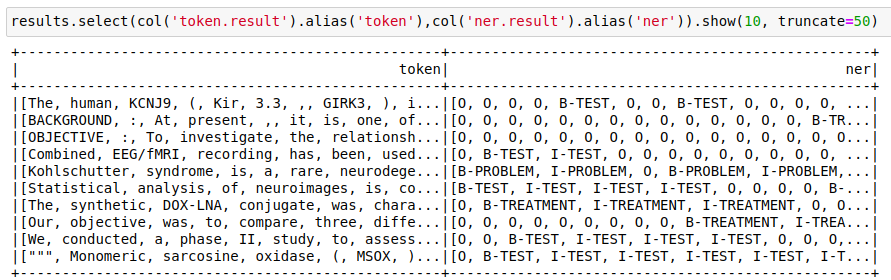

## Description

Pretrained named entity recognition deep learning model for clinical terms. Includes Problem, Test and Treatment entities. The SparkNLP deep learning model (NerDL) is inspired by a former state of the art model for NER: Chiu & Nicols, Named Entity Recognition with Bidirectional LSTM-CNN. 

{:.btn-box}
[Live Demo](){:.button.button-orange}
[Open in Colab](https://github.com/JohnSnowLabs/spark-nlp-workshop/blob/master/tutorials/Certification_Trainings/Healthcare/1.Clinical_Named_Entity_Recognition_Model.ipynb){:.button.button-orange.button-orange-trans.co.button-icon}
[Download](https://s3.amazonaws.com/auxdata.johnsnowlabs.com/clinical/models/ner_clinical_large_en_2.5.0_2.4_1590021302624.zip)
{:.button.button-orange.button-orange-trans.arr.button-icon}


## How to use

Your input text data should be in a spark dataframe in a column labeled "text".




```python

documentAssembler = DocumentAssembler()\
  .setInputCol("text")\
  .setOutputCol("document")

sentenceDetector = SentenceDetector()\
  .setInputCols(["document"])\
  .setOutputCol("sentence")

tokenizer = Tokenizer()\
  .setInputCols(["sentence"])\
  .setOutputCol("token")

word_embeddings = WordEmbeddingsModel.pretrained("embeddings_clinical", "en", "clinical/models")\
  .setInputCols(["sentence", "token"])\
  .setOutputCol("embeddings")

clinical_ner = NerDLModel.pretrained("ner_clinical_large", "en", "clinical/models") \
  .setInputCols(["sentence", "token", "embeddings"]) \
  .setOutputCol("ner")

ner_converter = NerConverter() \
  .setInputCols(["sentence", "token", "ner"]) \
  .setOutputCol("ner_chunk")

nlpPipeline = Pipeline(stages=[
    documentAssembler, 
    sentenceDetector,
    tokenizer,
    word_embeddings,
    clinical_ner,
    ner_converter])

empty_data = spark.createDataFrame([[""]]).toDF("text")

model = nlpPipeline.fit(empty_data)

results = model.transform(data)

```

```scala


```
{:.model-param}
## Model Parameters

{:.table-model}
|---|---|
|Model Name:|ner_clinical_large_en_2.5.0_2.4|
|Type:|ner|
|Compatibility:|Spark NLP 2.5.0|
|Edition:|Healthcare|
|License:|Enterprise|
|Spark inputs:|[sentence,token, embeddings]|
|Spark outputs:|[ner]|
|Language:|[en]|
|Case sensitive:|false|

{:.h2_title}
## Dataset used for training
Trained on augmented 2010 i2b2 challenge data with 'embeddings_clinical'.
https://portal.dbmi.hms.harvard.edu/projects/n2c2-nlp/

{:.h2_title}
## Results
The output is a dataframe with a sentence per row and a "ner" column containing all of the entity labels in the sentence, entity character indices, and other metadata. To get only the tokens and entity labels select "token.result" and "ner.result" from your output dataframe:

 